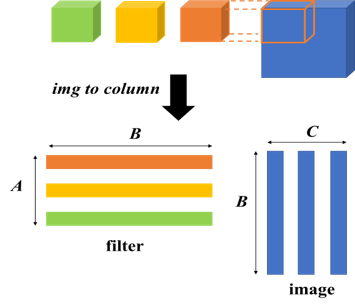
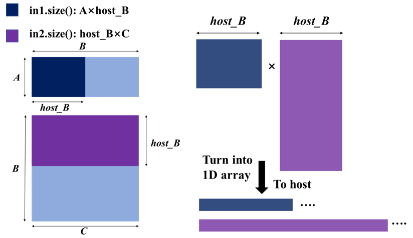
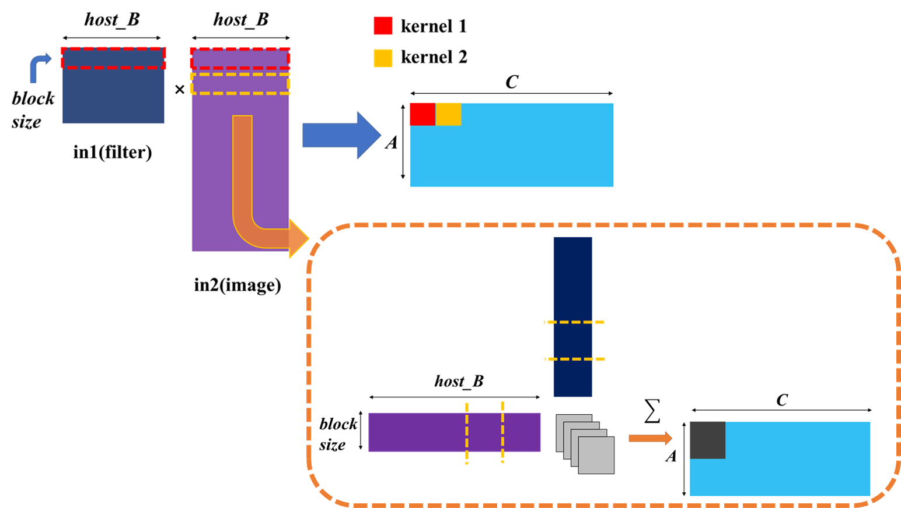
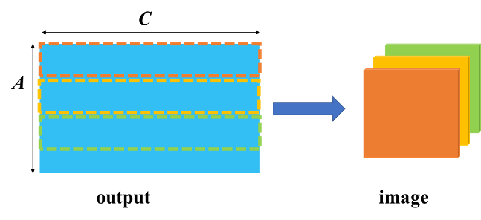

<strong>Project Final Report:</strong> 
  <a href="ESE539.pdf" class="btn-link" target="_blank" rel="noopener noreferrer">PDF</a>

This project, completed as part of the ESE539 course at UPenn, explores the co-design of software and hardware for machine learning by applying the advantages of FPGAs over traditional CPUs. Given that matrix multiplication—the core operation in convolutional layers—is computationally intensive, FPGAs’ superior parallel processing and specialized architecture can drastically reduce computation time.

In our work, we adapted the VGG16 model using the PyTorch framework by replacing standard convolutional layers with custom FPGA-accelerated layers. The FPGA accelerator, deployed via Amazon Web Services and programmed in C, is leveraged to execute these computationally demanding operations more efficiently.

The FPGA customization process can be summarized as follows:

- Flattening: Both the filters and the input image are transformed into one-dimensional row and column arrays, effectively converting the convolution operation into a matrix multiplication problem.
<figure style="text-align: center;">
    
    <figcaption>Flattening</figcaption>
</figure>

- Partitioning: The resulting matrix is divided into several submatrices to ensure they fit within the FPGA’s buffer constraints.
<figure style="text-align: center;">
    
    <figcaption>Partitioning</figcaption>
</figure>

- Computation: Each submatrix undergoes a multiply-and-accumulate process to build the overall result matrix.
<figure style="text-align: center;">
    
    <figcaption>Computation</figcaption>
</figure>

- Reshaping: Finally, the result matrix is reconstructed into multi-layer images, restoring the original spatial structure.
<figure style="text-align: center;">
    
    <figcaption>Reshaping</figcaption>
</figure>

Our experiments demonstrated a speedup of over **7 times** compared to traditional CPU-based methods. Although the current solution is not fully optimal and leaves room for further improvement, the findings clearly indicate that FPGA-based architectures hold significant potential for accelerating deep learning computations.

