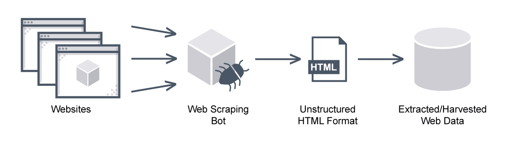
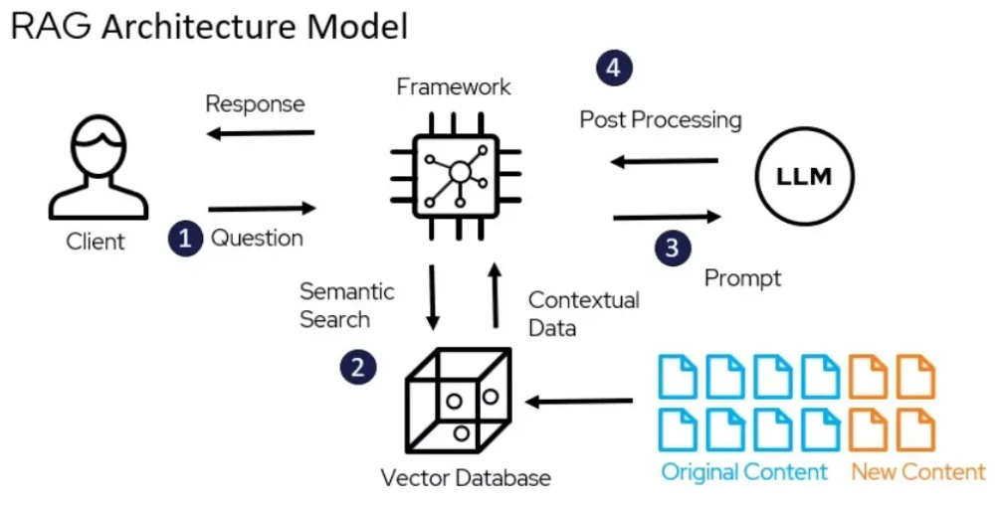

<strong>GitHub Folder:</strong> 
  <a href="https://github.com/WillChan9/Market-digest" class="btn-link" target="_blank" rel="noopener noreferrer">PDF</a>

## Overview

Market Digest is an intelligent financial research platform that automates the collection, processing, and analysis of public macroeconomic reports from major financial institutions. The platform combines web scraping, natural language processing, and vector database technology to create a powerful knowledge base for financial research and trading strategy development.

<figure style="text-align: center;">
    
    
    <figcaption>Web scraper and RAG chatbot workflow.</figcaption>
</figure>

### Key Features

- **Automated Data Collection**: Scrapes macroeconomic reports from leading financial institutions including:
  - BlackRock
  - Goldman Sachs
  - J.P. Morgan
  - Morgan Stanley
  - Federal Reserve
  - European Central Bank
  - Bank for International Settlements (BIS)
  - Lombard Odier
  - Merrill Lynch
  - WisdomTree
  - J. Safra Sarasin
  - T. Rowe Price
  - International Monetary Fund (IMF)

- **Intelligent Processing**:
  - Extracts and structures content from PDF reports
  - Generates concise summaries using advanced language models
  - Organizes data in a vector database for semantic search capabilities

- **Interactive Research Assistant**:
  - Natural language interface for querying the knowledge base
  - Semantic search to find relevant market insights
  - Context-aware responses based on historical reports
  - Support for complex queries about market trends and economic indicators

- **Trading Strategy Support**:
  - Access to historical market analysis and predictions
  - Identification of key market themes and trends
  - Correlation analysis between different market indicators
  - Foundation for building data-driven trading strategies

### Use Cases

1. **Market Research**:
   - Quick access to the latest market insights from major institutions
   - Historical analysis of market trends and predictions
   - Cross-reference multiple sources for comprehensive analysis

2. **Trading Strategy Development**:
   - Identify market themes and sentiment
   - Track institutional positioning and outlook
   - Analyze historical patterns and correlations
   - Support for both fundamental and quantitative trading strategies

3. **Risk Management**:
   - Monitor global economic indicators
   - Track institutional risk assessments
   - Identify potential market risks and opportunities

4. **Portfolio Management**:
   - Access to asset allocation recommendations
   - Sector and region-specific insights
   - Market timing indicators

### Technical Architecture

The platform is built with a modern tech stack:
- Python-based web scrapers for data collection
- AWS S3 for document storage
- Pinecone vector database for semantic search
- OpenAI's language models for text processing
- Docker containers for deployment
- AWS ECS for container orchestration

