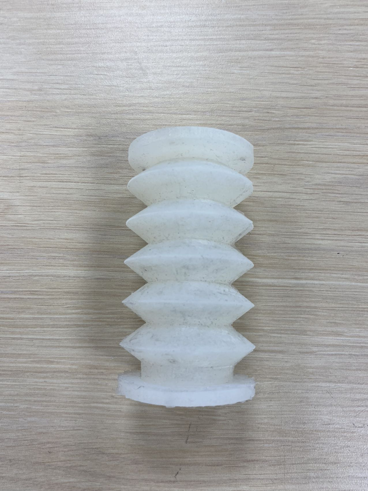
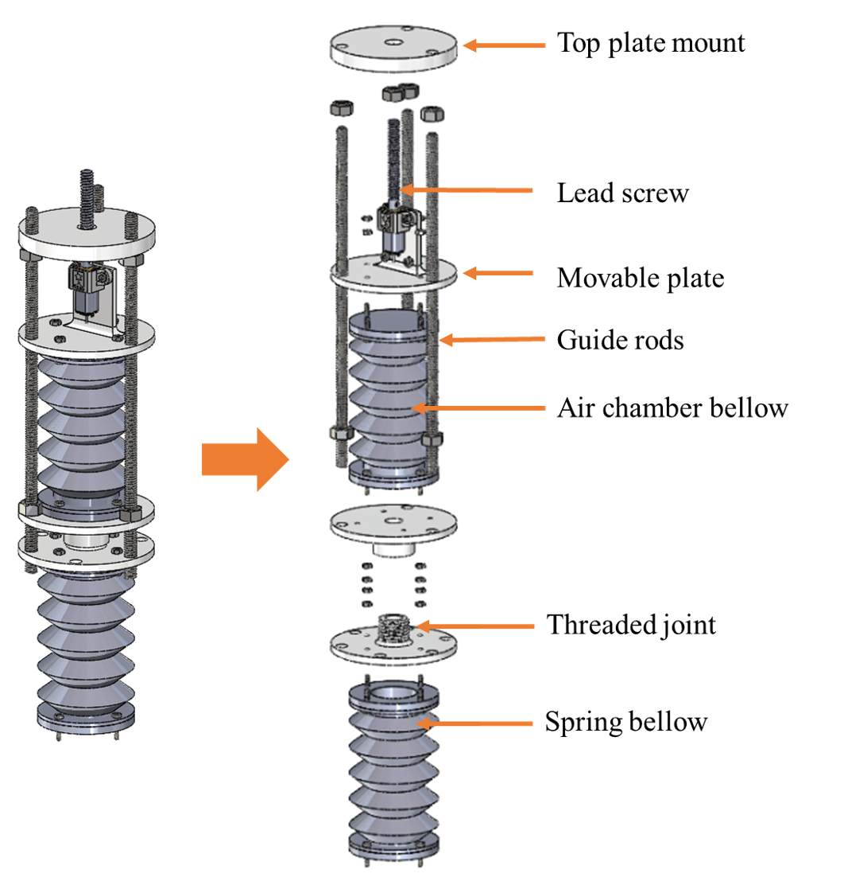
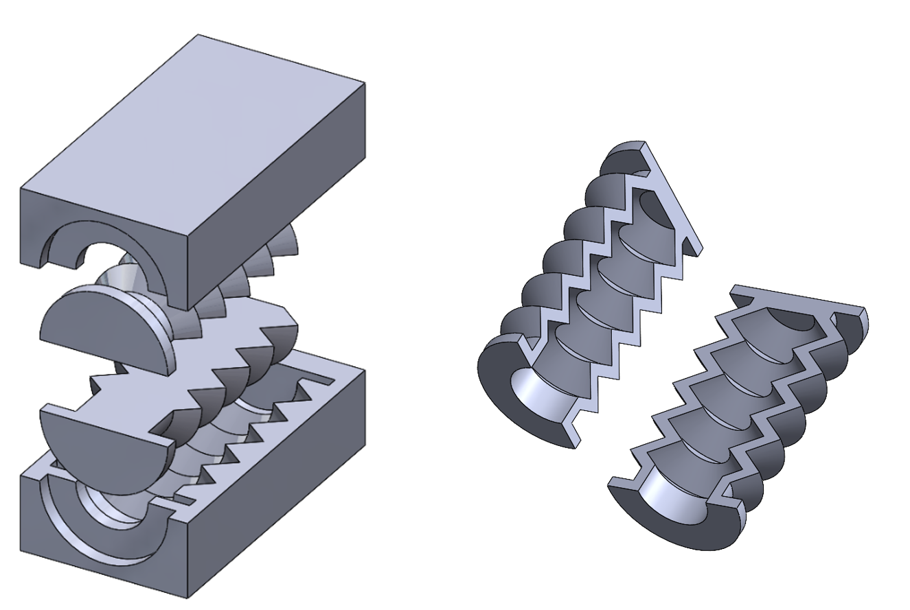
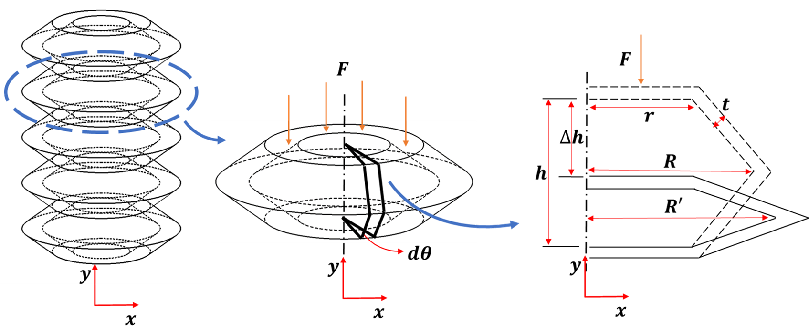
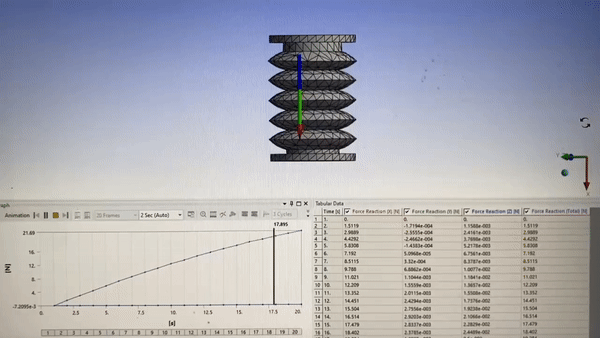

  <a href="Design_and_Characterization_of_a_Pneumatic_Tunable-Stiffness_Bellows_Actuator.pdf" class="btn-link" target="_blank" rel="noopener noreferrer">RoboSoft 2024 Paper</a>

Pneumatic actuators is one of the most commonly used soft actuators due to its high power-to-weight ratio, flexibility, and fast response.  While the actuators can be simple, controlling them with precision can be challenging due to the non-linearities in the actuation. Also, compressed air source can introduce variability in the actuator's performance and limit the autonomy and portability of robot devices.

So in this study, we are aiming to build a pneumatic actuator that is free of air compress source and valves. We are also trying to find an precise model to characterize its output including position, volume, pressure and force.

<figure style="text-align: center;">
    
    <figcaption>Bellows actuator prototype</figcaption>
</figure>

The actuator is composed of two bellows. The first bellow functions as an air reservoir, with its volume regulated by a movable plate, which is guided by three rods. The vertical position of this plate is precisely controlled by a motor-driven lead screw. The second bellow operates as a spring with adjustable stiffness and is connected to the air chamber bellow via a threaded joint (or alternatively, a barbed tube). As the volume of the air chamber bellow shifts, it results in a pressure change that in turn dictates the stiffness of the spring bellow.

We mold the bellows with silicone rubber. The mold is divided into 2 pieces, and it bonds together to make a complete part.

<figure style="text-align: center;">
  
  <figcaption>Bellows actuator CAD</figcaption>
</figure>

<figure style="text-align: center;">
    
    <figcaption>Bellows mold design</figcaption>
</figure>

To obtain the analytical solution for the stiffness of the bellows, we break it down into multiple segments. Each of these segments can be further dissected into infinitesimally thin V-shaped beams. Under the assumption that the joints behave as hinges and that there's no warping of the walls, the force output can be straightforwardly determined from two components: the energy from material strain and the energy from compressed air.

<figure style="text-align: center;">
    
    <figcaption>Bellows geometric model</figcaption>
</figure>

The behavior of soft materials can deviate from the ideal. Specifically, significant wall deflections arise from vertical forces, while compressed air contributes to noticeable bulging and buckling. These factors lead to the bellows exhibiting nonlinear behavior. To precisely capture these shape transformations, we've adopted a data-driven model that relates volume to both displacement and pressure, refining our understanding of force output.

For an in-depth exploration of the related equations and experimental details, kindly refer to our paper.

<figure style="text-align: center;">
    
    <figcaption>Bellows finite element analysis</figcaption>
</figure>

<figure style="text-align: center;">
    
    <figcaption>MTS testbench</figcaption>
</figure>