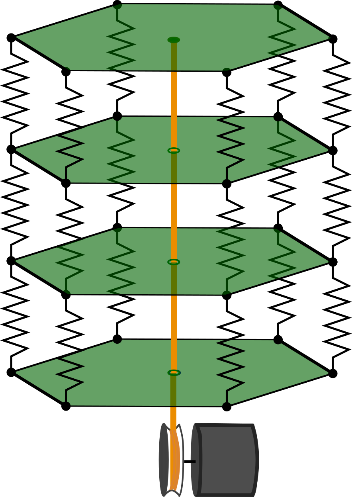
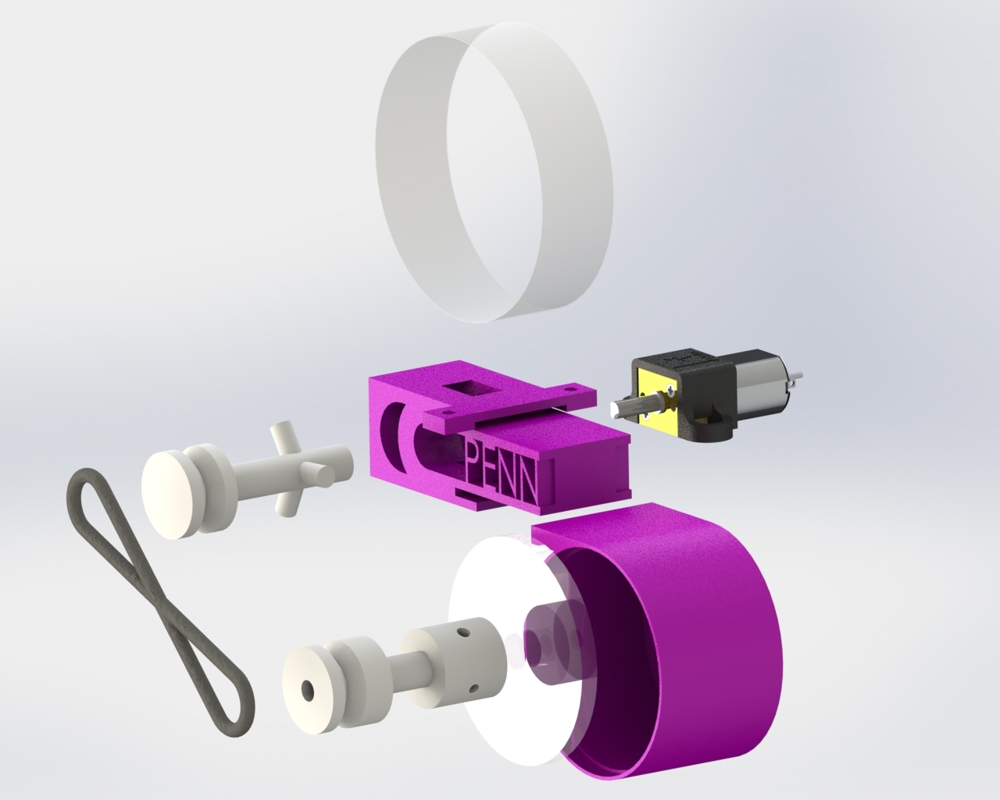
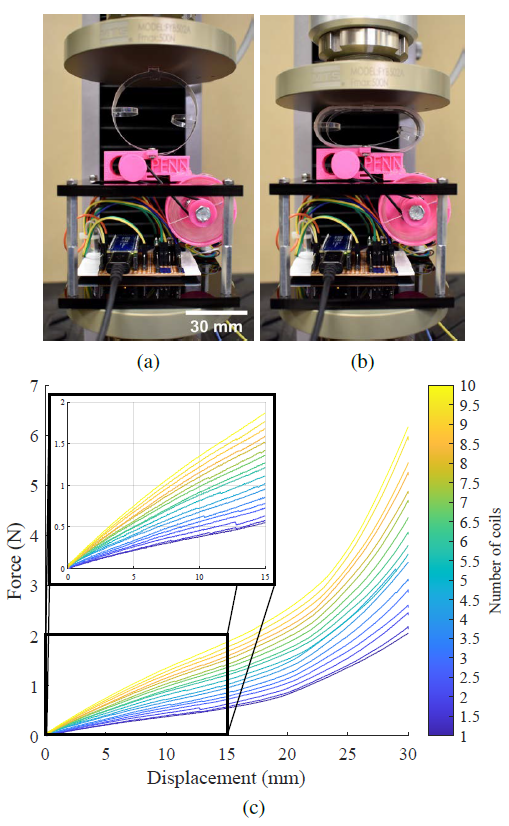
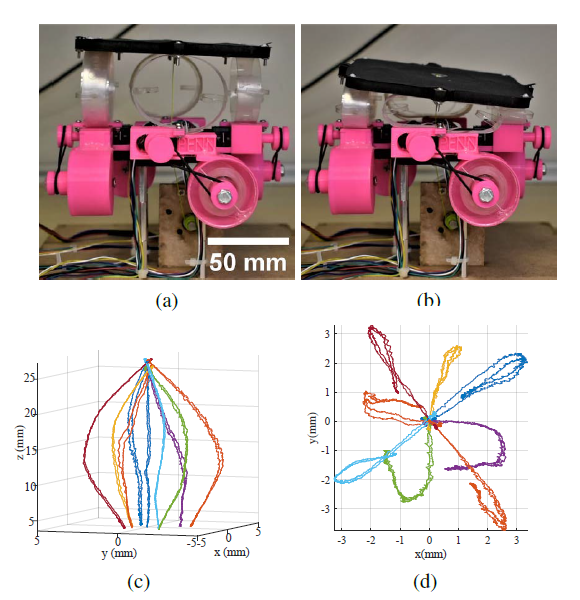
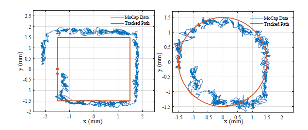

<strong>ICRA 2023 Paper:</strong> 
  <a href="Design_and_Control_of_a_Tunable-Stiffness_Coiled-Spring_Actuator.pdf" class="btn-link" target="_blank" rel="noopener noreferrer">PDF</a>

**Demo video of Coil Spring:**



Soft robots have many advantages compared to rigid robots, including the ability to deform continuously and compliantly, adapt to unknown situations, and so on. In this research project, we design and build a new kind of manipulator using tunable stiffness springs.

<figure style="text-align: center;">
    
    <figcaption>The structure of the multi-segment manipulator</figcaption>
</figure>

The manipulator has several segments, and each segment has several springs. Now suppose the springs in each segment have different stiffness, then each segment would turn in its own direction when the central tendon is pulled down. The system tends to the state of lowest energy at any time, so by constructing the potential energy of the manipulator and solving the optimization problem, we can obtain forward kinematics equations. The following picture is the first version of our manipulator, using stiffness unchangeable TPU springs.

<figure style="text-align: center;">
    
    <figcaption>The multi-segment manipulator with TPU springs</figcaption>
</figure>

For the next prototype, we switch the TPU springs to our new-designed tunable stiffness coil-springs. The coil consists of a ribbon, which is driven by a motor-driven dispenser and stored inside a drum storage. The stiffness is changed by controlling the layers inside the coil. We built a nested ring compression model, and the simulation well-align with the experiment result with measured parameters.

<figure style="text-align: center;">
    
</figure>

<figure style="text-align: center;">
    
    <figcaption>Spring model and simulation</figcaption>
</figure>

The actual coil spring prototype and stiffness test for the spring are shown below. The spring is limited to 10 layers due to the friction and motor torque limit. The result shows that it has a high resolution and performs pretty linearly in the first half of compression.

<figure style="text-align: center;">
    
    <figcaption>Exploded view of tunable stiffness actuator spring</figcaption>
</figure>

<figure style="text-align: center;">
    
    <figcaption>Experimental stiffness test for single spring</figcaption>
</figure>

We built a 3 DOF single-segment manipulator with 4 springs, a motor-driven tendon connected to the center of the top plate controls the total extension of the manipulator. By tracking center of top plate, we obtained the considerable workspace, and shows a good control accuracy. 

<figure style="text-align: center;">
    
    
    <figcaption>Workspace test and trajectory control test for single segment manipulator</figcaption>
</figure>

With this novel spring design, we accurately reach our desired stiffness and control the top plate to follow the goal trajectory. In the future, we will build a multi-segment one with a new control algorithm, so that it can move like a snake!