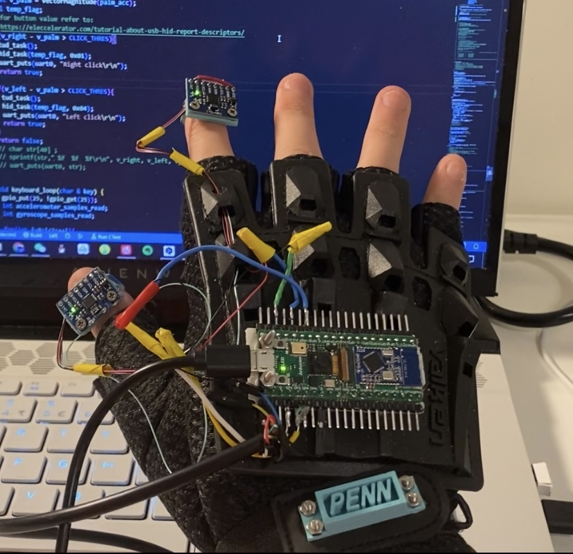
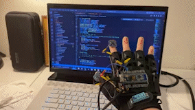

We designed a mouse-keyboard system embedded on a glove that provides cursor control and handwriting input functions. This innovative wearable technology aims to replace traditional mouse and keyboard interfaces with a more intuitive, gesture-based control system.

<figure style="text-align: center;">
    
    <figcaption>The glove system with embedded sensors and electronics</figcaption>
</figure>

## System Architecture

The system incorporates three Inertial Measurement Units (IMUs) strategically positioned on the glove:
- **Back of the hand**: Primary orientation tracking
- **Index finger**: Precise movement detection for handwriting
- **Thumb**: Additional control input and gesture recognition

<figure style="text-align: center;">
    
    <figcaption>Demonstration of the glove's cursor control functionality</figcaption>
</figure>

## Mouse Control Implementation

The cursor control system operates through palm direction changes, with cursor position determined by gravity direction using accelerometer data. We deliberately avoided gyroscope data due to drift issues that would compromise accuracy.

Key features of the mouse control:
- **Gravity-based positioning**: Uses accelerometer data for stable cursor positioning
- **Touch detection**: Fingertip sensors detect tapping actions to send click commands
- **Pinch-to-activate**: Touch switch on fingers ensures cursor movement only occurs during intentional "pinch" gestures
- **Real-time responsiveness**: Achieves mouse-like accuracy and control

The mouse functionality was successfully implemented with several thousand lines of code, demonstrating the complexity and sophistication of the gesture recognition algorithms.

## Handwriting Recognition

The keyboard function utilizes the index finger's 3D trajectory data for handwriting recognition in air. The system processes 3D spatial trajectories and feeds them through a convolutional neural network to recognize letters and numbers.

**Technical Implementation:**
- **Data Collection**: 3D trajectory data from index finger movements
- **Neural Network**: Convolutional neural network for character recognition
- **Training Results**: Achieved 90% accuracy in character recognition
- **Deployment Challenge**: Encountered difficulties deploying TensorFlow Lite model in the embedded system

## Future Development

The project demonstrates the potential for wearable technology to replace traditional computer input devices. Future improvements could include:
- Complete resolution of TensorFlow Lite deployment issues
- Enhanced gesture recognition algorithms
- Integration with virtual reality systems
- Commercial applications in accessibility and gaming

The mouse function works exceptionally well, providing accurate and responsive cursor control. With continued development, this technology could revolutionize how we interact with computers, offering a more natural and intuitive interface than traditional mouse and keyboard systems.
