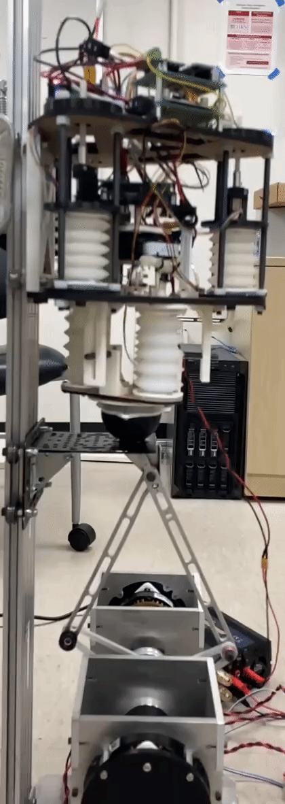
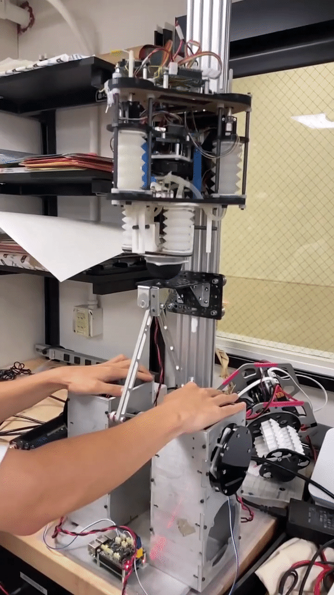
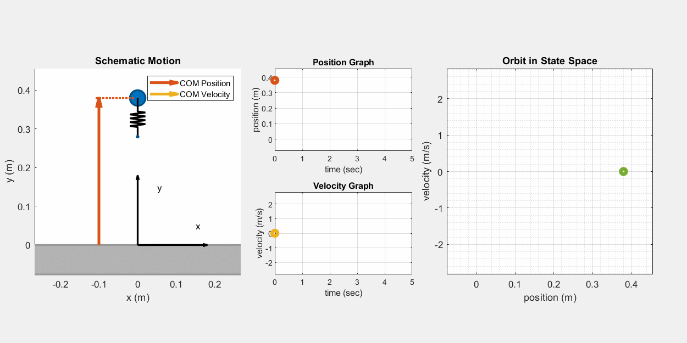
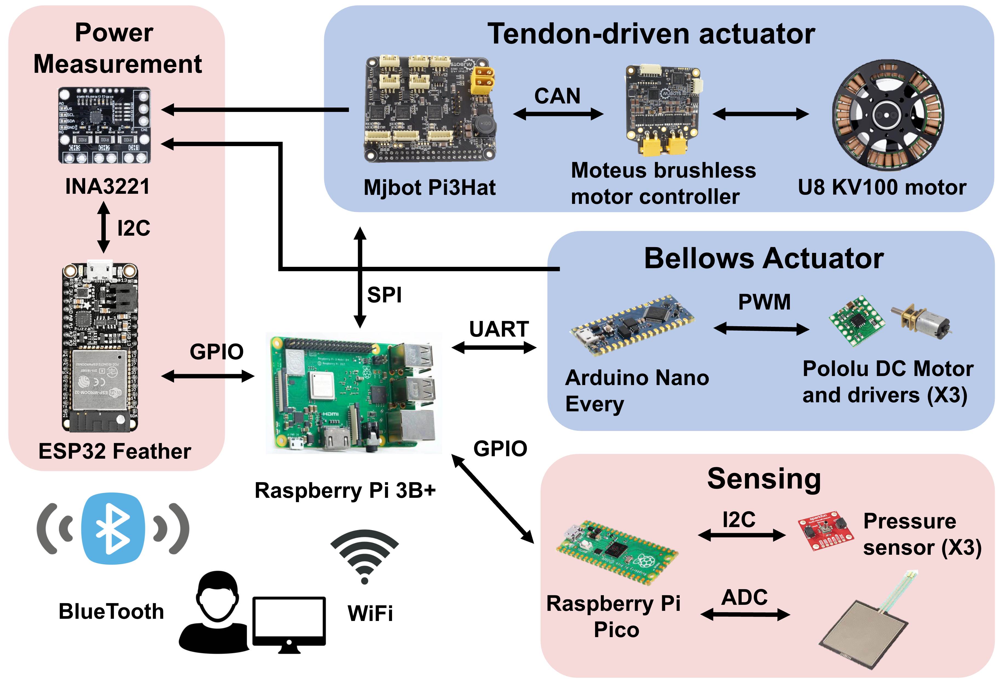

<strong>ICRA 2025 Accepted Paper:</strong> 
  <a href="ICRA2025_HASTA_Robot.pdf" class="btn-link" target="_blank" rel="noopener noreferrer">PDF</a>

<strong>My Master Thesis:</strong> 
  <a href="master_thesis.pdf" class="btn-link" target="_blank" rel="noopener noreferrer">PDF</a>

<strong>GitHub repo:</strong> 
  <a href="https://github.com/WillChan9/kodlab_mjbots_sdk" class="btn-link" target="_blank" rel="noopener noreferrer">GitHub</a>

**Demo video of HASTA project:**



Legged robots are inspired by natural creatures, which offers unique advantages over wheeled robots in complex environments. Some studies show that animals will adjust their leg behavior while in different environments. So in this research, we are aiming to find energy loss reduction strategies by studying how the leg makes contact with the ground.

So in this study, we built a monopedal legged hopper robot and ground emulator, modeled the leg and hopper behavior, and characterized them with experiments. We also proposed a ground adaptation strategy for saving energy during the stance phase, based on the stiffness and damping coefficient of the system.

    
    

The gif above demonstrate the functionality of the hopper and the ground emulator. The ground emulator has the capability to adjust its platform's stiffness and damping. Meanwhile, the hopper's leg can modify its stiffness using pneumatic tunable-stiffness bellows actuators, powered by a central tendon which is managed by a brushless motor.

Through simulations, it's observed that by adjusting the leg stiffness, the hopper can minimize energy use for particular ground conditions. Hence, it's crucial to develop a mathematical model to grasp the impact of various hopper parameters on its dynamic behaviors. For sustained hopping on the surface, the hopper has to replenish energy to offset the energy lost due to damping. In this process, the hopper pre-compresses its leg mid-air and releases it upon detecting ground contact. With consistent pre-compression, the hopping height converges and its dynamic state converges to a limit cycle, as depicted in the subsequent illustration.

<figure style="text-align: center;">
    
    <figcaption>The hopper state will converge to a limit cycle in the phase portrait</figcaption>
</figure>

In our prototyping phase, our team dedicated a significant amount of time to the design and development of the mechanical structure, electrical framework, and software system. We employed a diverse array of fabrication techniques to construct the prototype, such as molding, 3D printing, laser cutting, turning, and milling. We also opted for varied materials to suit different components. For instance, silicone rubber was used for the actuator, nylon for the guide rods, wood for the base plates, aluminum for motor standoffs, carbon fiber for the pulley systems, and Ultra-High Molecular Weight Polyethylene (UHMWPE) for the central tendon. This strategic selection of materials ensured that our system was not only efficient and durable but also lightweight and sturdy. For a deeper dive into the design specifics, please refer my master's thesis or our ICRA papers.

<figure style="text-align: center;">
    
    <figcaption>Hopper mechanism overview</figcaption>
</figure>

The hardware and software components represent a significant portion of our work. Our system comprises four microcontrollers, with each responsible for a distinct role:

- Raspberry Pi 3B+ acts as the primary controller, undertaking most of the mathematical computations.

- Arduino Nano is utilized for actuator stiffness control, specifically chosen for its abundance of external interrupt pins.

- ESP32 monitors the system's power usage and communicates this data to the user via Bluetooth.

- Raspberry Pi Pico gauges the hopper toe force and the pressure within the leg bellows. We also envision deploying machine learning models on this microcontroller in the future.

<figure style="text-align: center;">
    
    <figcaption>Hopper electronic system overview</figcaption>
</figure>