

<strong>VTC 2022 Paper:</strong> 
  <a href="mmwave_paper.pdf" class="btn-link" target="_blank" rel="noopener noreferrer">PDF</a>

<strong>My Undergraduate Theis (本科毕业论文):</strong> 
  <a href="undergrad_thesis.pdf" class="btn-link" target="_blank" rel="noopener noreferrer">PDF</a>

As part of my undergraduate thesis project, I developed a target tracking algorithm for automotive millimeter-wave (mmWave) radar, specifically utilizing Texas Instruments’ AWR1642 sensor. Due to the low resolution of radar images, classifying objects remains challenging. To improve target distinguishability, I implemented a clustering-based approach that groups individual radar detection points into meaningful clusters, allowing for the extraction of richer features such as shape, area, and density.

<figure style="text-align: center;">
    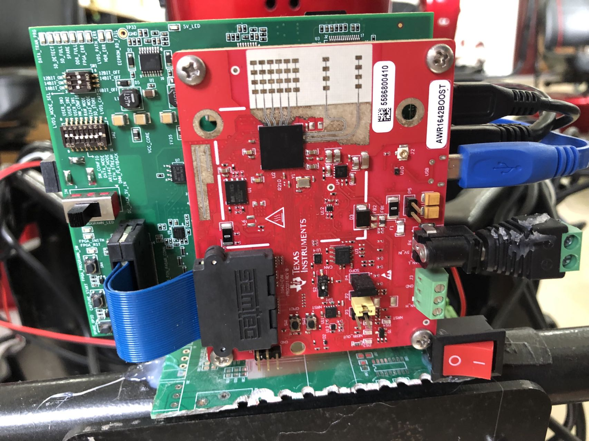
    <figcaption>Automotive radar sensor AWR1642 from Texas Instrument</figcaption>
</figure>

Instead of relying on individual points with limited information, the algorithm aggregates similar points into clusters, leveraging spatial and motion-based characteristics. The clustering process is enhanced by incorporating additional criteria, such as velocity and amplitude, to improve accuracy and reduce false detections.

<figure style="text-align: center;">
    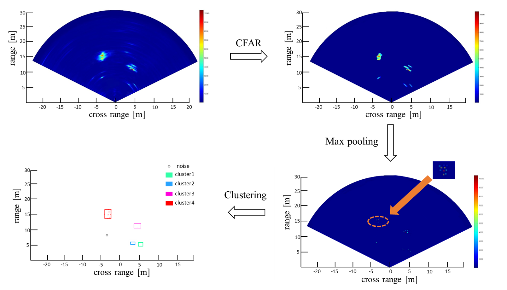
    <figcaption>Clustering Algorithm</figcaption>
</figure>

For data association, I designed a similarity function to match clusters across frames based on multiple features, including distance, velocity, area, overlapping regions, and amplitude. This approach ensures robust cluster tracking, even in noisy environments. The system then applies a Kalman filter to refine trajectory estimates, ensuring smooth and accurate tracking of moving objects.

The algorithm was tested in various automotive scenarios, demonstrating improved object tracking accuracy and trajectory prediction. The results validate the effectiveness of the proposed clustering and data association methods in enhancing radar-based target tracking for autonomous driving applications.

<figure style="text-align: center;">
    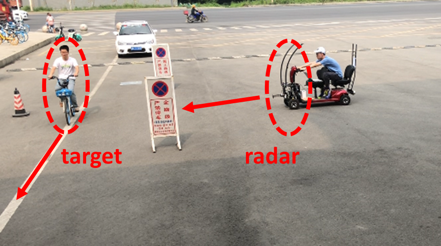
    <figcaption>Test scenario</figcaption>
</figure>

    <figure style="text-align: center;">
        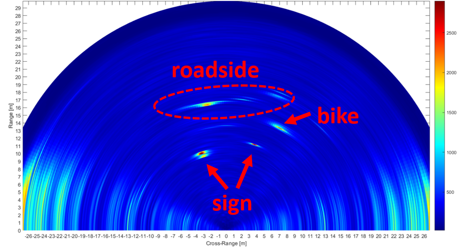
    </figure>
    <figure style="text-align: center;">
        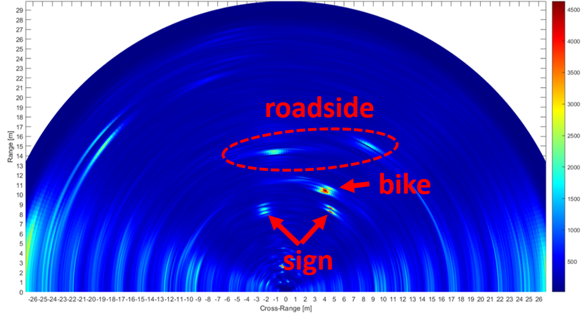
    </figure>
    <figure style="text-align: center;">
        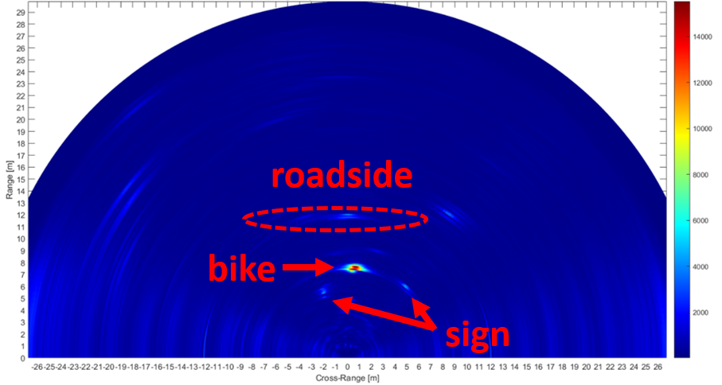
    </figure>
    <figure style="text-align: center;">
        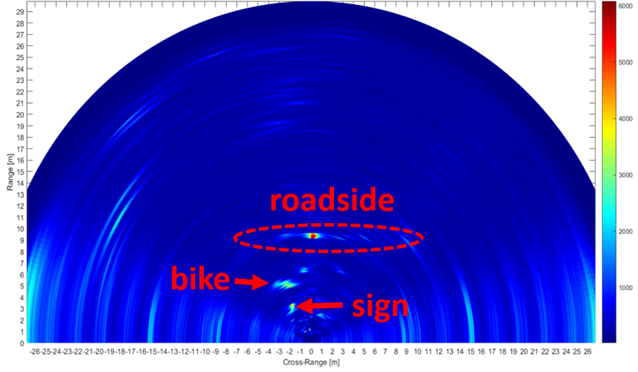
    </figure>

    <figure style="text-align: center;">
        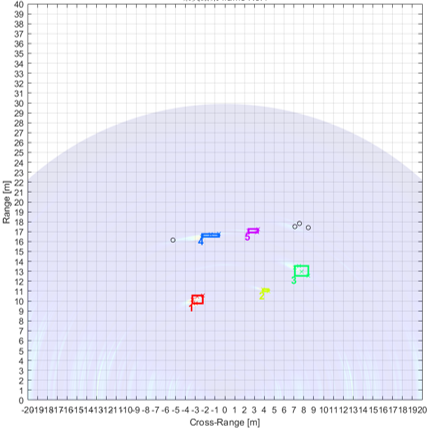
    </figure>
    <figure style="text-align: center;">
        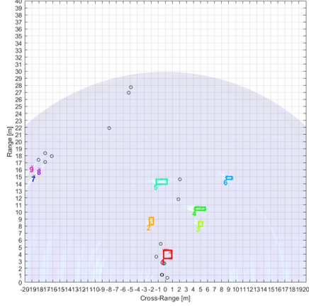
    </figure>
    <figure style="text-align: center;">
        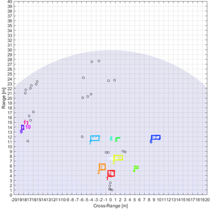
    </figure>
    <figure style="text-align: center;">
        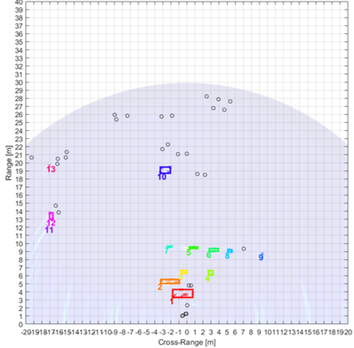
    </figure>
    

<figure style="text-align: center;">
    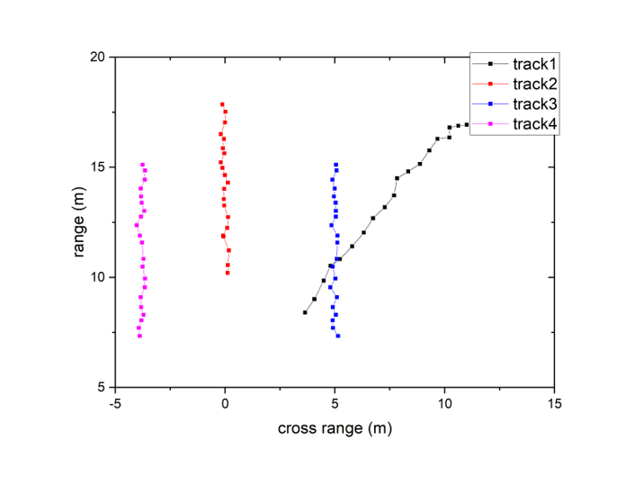
    <figcaption>The tracking result</figcaption>
</figure>