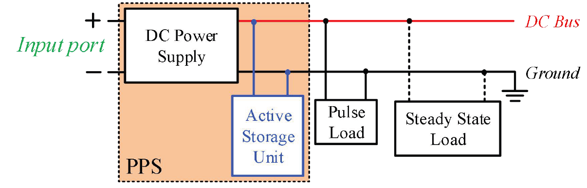
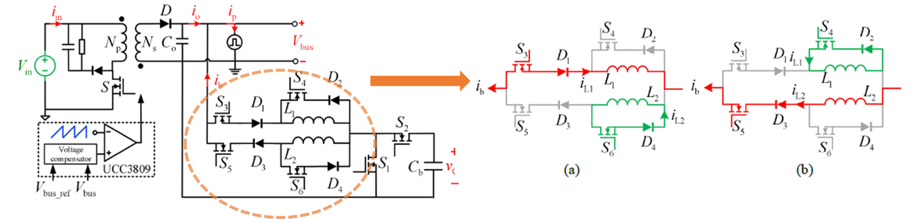
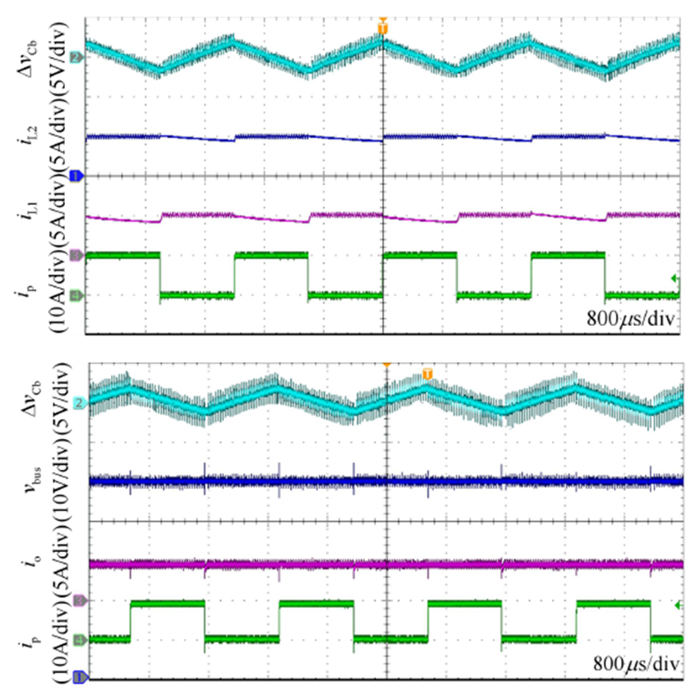
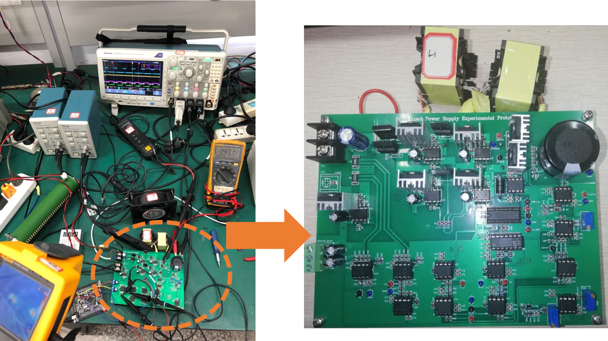

<strong>IEEE JETCAS Paper:</strong> 
  <a href="Stability_Improvement_of_Pulse_Power_Supply_With_Dual-Inductance_Active_Storage_Unit_Using_Hysteresis_Current_Control.pdf" class="btn-link" target="_blank" rel="noopener noreferrer">PDF</a>

The Pulse Power Supply (PPS) delivers periodic high-power pulses, widely used in industrial and military applications. However, the conversion from DC power to high pulse power often leads to stability issues, particularly voltage fluctuations and current spikes. Our research focused on enhancing stability by implementing a **Dual-Inductance Active Storage Unit (ASU)** combined with **Hysteresis Current Control (HCC)** to regulate compensating currents effectively.

<figure style="text-align: center;">
    
    <figcaption>System Diagram</figcaption>
</figure>

The Active Storage Unit (ASU) is responsible for stabilizing the DC bus voltage while delivering pulse currents. It consists of a conversion circuit and a capacitor, which stores energy when the pulse current is at its lowest. The dual-inductance design replaces the conventional single inductor, creating independent current flow paths that enhance stability.

<figure style="text-align: center;">
    
    <figcaption>System Diagram</figcaption>
</figure>

The ASU functions as a buck-boost converter with two distinct operating modes:
- Boost Mode (Low Current Demand): The capacitor charges through diode D1.
- Buck Mode (High Current Demand): The capacitor discharges through diode D3.
- Inductor L1 & Switch S4: During buck mode, L1 remains in the loop with S4, ensuring a steady current flow.

Experimental results demonstrated that our 500W prototype (100-500Hz pulse frequency) successfully:

- ✅ Reduced voltage ripple on the DC bus
- ✅ Eliminated current spikes, improving system stability
- ✅ Provided a smooth output waveform, enhancing power efficiency

<figure style="text-align: center;">
    
</figure>

The final testbench and prototype verified the effectiveness of our design in improving pulse power supply performance, as shown follows.

<figure style="text-align: center;">
    
    <figcaption>Pulse Power Prototype</figcaption>
</figure>
