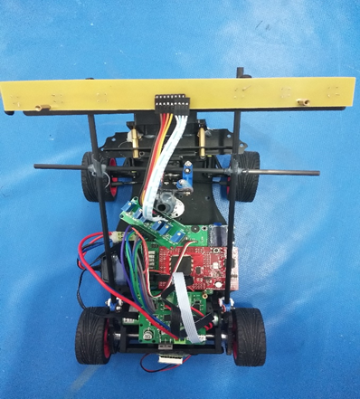
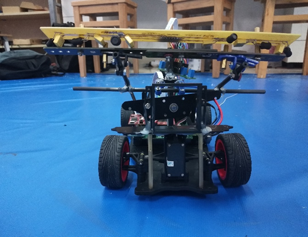
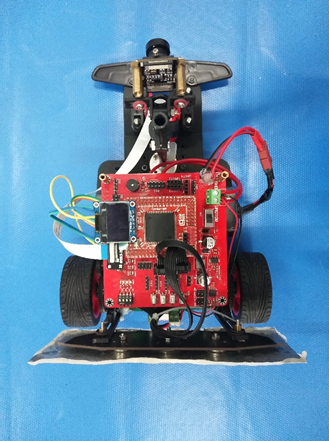
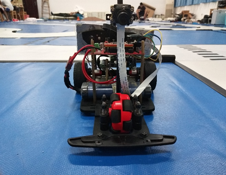
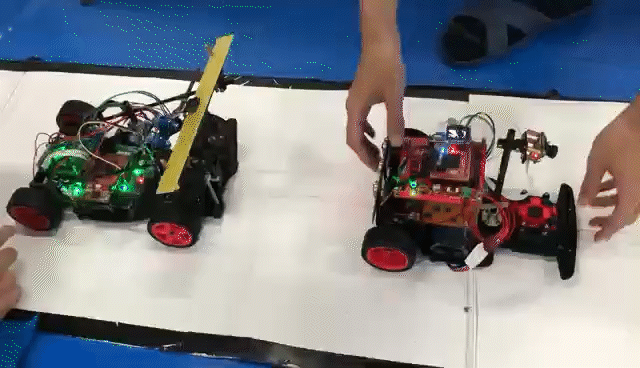
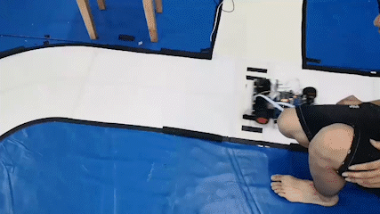
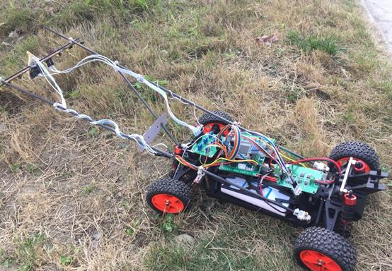

## Project Overview

The National University Students Intelligent Car Race is one of the most prestigious robotics competitions in China, attracting hundreds of universities annually. This multidisciplinary competition challenges teams to design and build autonomous racing cars that can navigate complex tracks using various sensing and control technologies. The competition covers multiple domains including control theory, computer vision, machine learning, sensing technology, electronics, and mechanical engineering.

I participated in this competition across two different categories:

- **All-terrain Group** (Jan. 2019 ~ Apr. 2019)
- **Two-car Relay Group** (Jun. 2020 ~ Aug. 2020)

## Two-Car Relay System (2020)

In the two-car relay competition, teams must coordinate two autonomous vehicles to complete a relay race. The objective is to reach the finish line in minimal time while successfully passing a ball between the two cars at a designated relay point.

### Vehicle Design and Sensing

    

        
        
        
<strong>First Car - Electromagnetic Navigation</strong>

    

    

        
        
        
<strong>Second Car - Camera Vision</strong>

    

The first car utilized electromagnetic sensors to detect signals embedded in the guide line, providing reliable navigation through the track. The second car employed computer vision for perception, using camera-based algorithms to identify track boundaries and obstacles.

### Ball Transfer Mechanism

The relay system featured an innovative electromagnet-based ball transfer mechanism. When the first car reached the relay point, a collision detection system triggered the electromagnet to pass the ball to the second car, which would then carry it to the terminal.

<figure style="text-align: center;">
    
    <figcaption>The relay ball and electromagnet passing device</figcaption>
</figure>

### Hardware Development

As part of a 5-member team, I was responsible for developing the hardware and control systems. The electronic circuits included:

- **Power Management**: Efficient battery management and voltage regulation
- **Signal Processing**: Amplification and filtering of electromagnetic signals
- **Motor Driving**: Precise control of DC motors for propulsion and steering
- **Main Control Board**: Central processing unit coordinating all subsystems

<figure style="text-align: center;">
    
    <figcaption>Tuning PID control parameters for the camera-navigated car</figcaption>
</figure>

<figure style="text-align: center;">
    
    <figcaption>The racing cars in action</figcaption>
</figure>

### Deep Learning Control Experiment

Beyond traditional PID control, we also experimented with deep learning-based control systems. The neural network model took six inductance sensor values and previous outputs as input, predicting the servo motor's turning angle as output.

Considering the computational limitations of microcontrollers, we implemented fully-connected neural networks. Training data was collected using the camera-navigated car equipped with inductance sensors, and the model was trained on the collected electromagnetic signal data.

While the deep learning approach didn't outperform the PID method in this application, it provided valuable insights into the challenges of implementing AI-based control in resource-constrained embedded systems.

<figure style="text-align: center;">
    
    <figcaption>The electromagnetic-navigated car performance</figcaption>
</figure>

## All-Terrain Racing Car (2019)

The 2019 competition challenged teams to build vehicles capable of navigating diverse terrain types including puddles, grassland, and ramps. Mechanical design was crucial for success in this category.

### Terrain Adaptation

The all-terrain car followed electromagnetic guide signals using resonant circuits to amplify weak signals. The vehicle needed to maintain stability and traction across various surface conditions.

<figure style="text-align: center;">
    
    <figcaption>The all-terrain racing car</figcaption>
</figure>

### Hardware Implementation

I developed the complete hardware circuit system including:

- **Signal Processing**: Resonant circuits for electromagnetic signal amplification
- **Motor Driving**: Robust motor control for varied terrain conditions
- **Main Control Board**: NXP K60 microcontroller-based control system

While the car experienced challenges in sharp turns due to design limitations, this first attempt at autonomous vehicle design provided valuable experience in mechanical engineering, electronics, and control systems integration.

## Technical Challenges and Learning Outcomes

This project provided hands-on experience in:

- **Multi-disciplinary Integration**: Combining mechanical, electrical, and software systems
- **Real-time Control**: Implementing PID and AI-based control algorithms
- **Sensor Fusion**: Integrating multiple sensing modalities (electromagnetic, vision)
- **Embedded Systems**: Developing efficient code for resource-constrained microcontrollers
- **Team Collaboration**: Coordinating hardware, software, and mechanical development

The two-month development period was both challenging and rewarding, offering practical experience in autonomous vehicle design and control system implementation.
