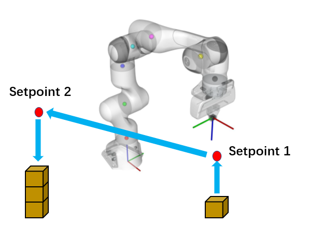
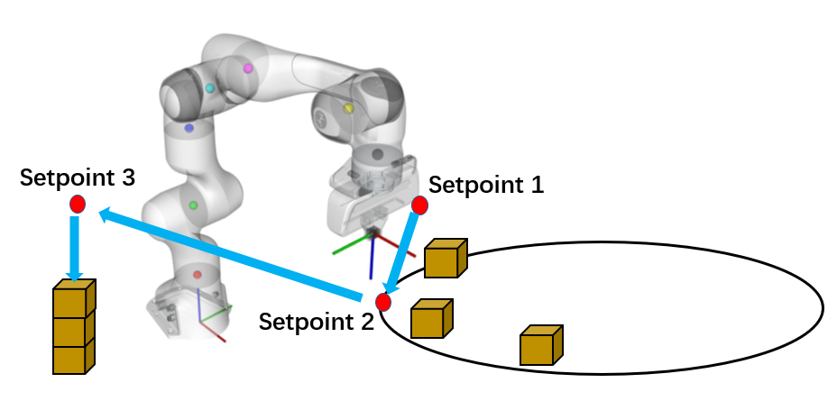
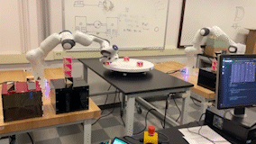
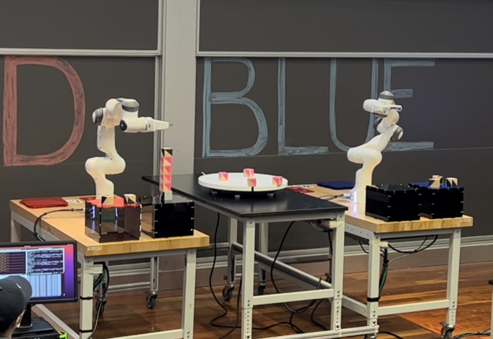

The challenge was for the final project of MEAM 520(Intro to Robotics) at UPenn. The robotic arm needed to pick up and stack the blocks placed on the static table and rotating turntable. The final score was determined by the block's direction(white surface face up), tower height, and block type(dynamic one is twice than static one). Here is the simulation scenario in ROS and experimental setup.

<figure style="text-align: center;">
    
    
</figure>

We then developed a robust and reliable solution for acquiring and stacking blocks, and our proposed algorithm was tested in simulation and evaluated in experimental setups. Moreover, we used some new strategies to improve the algorithm’s performance, which greatly reduced the time cost and sped up the movement.

For path planning, we used RRT(rapid exploring random tree) Algorithm for searching the potential paths and avoiding obstacles. In order to reduce the computation time, we use hard-coded paths in fixed setpoints and trajectories(while it still depends on the tower height) and only apply the path planning computation in the pick-up stage.

    
    

<figure style="text-align: center;">
    
</figure>

Here is the process of how it works: First, the blocks' location and direction were recognized by computer vision models. Then the arm computes the shortest way with the least rotating angle to the goal block. Once the block got grabbed, the arm will follow the path between fixed setpoints. Since computer vision is not allowed in dynamic blocks, we used a scooping pose to blindly grab the blocks, which proved to be an effective way. Finally, we developed several grabbing plans for different situations to maximize our score. Since on the battlefield, your opponent could steal your blocks in advance! 

<figure style="text-align: center;">
    
    <figcaption>Final Battle</figcaption>
</figure>